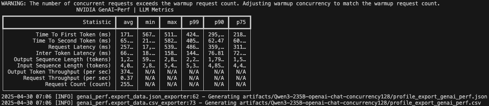

# GenAI-Perf
GenAI-Perf是由Nvidia官方推广的LLM benchmark组件。目前该项目仍在开发阶段，可能会频繁快速迭代，与该文档的一切差异以[官方最新文档](https://docs.nvidia.com/deeplearning/triton-inference-server/user-guide/docs/perf_analyzer/genai-perf/README.html)为准。

## 环境安装
GenAI-Perf的核心组件为genai-perf和perf_analyzer。可通过本机直接部署和容器部署的方法进行安装。本机直接部署对环境版本要求较高，需要Ubuntu 24.04,python 3.10+,CUDA 12版本，因此建议直接采用容器部署。
### 1. 本机部署

1. 用以下命令确认(`genai-perf`调用运行`perf_analyer`需要用到)：
    
    `libc`库中是否有`GLIBC_2.38`; 
    
    `libstdc++`库中是否有`GLIBCXX_3.4.31`和`GLIBCXX_3.4.32`版本。
    ```
    strings /lib/x86_64-linux-gnu/libc.so.6 | grep GLIBC
    strings /usr/lib/x86_64-linux-gnu/libstdc++.so.6 | grep GLIBCXX
    ```
2. 使用pip安装:
    ```
    pip install genai-perf
    ```

### 2. 容器部署

1. 拉取以下镜像:
    ```
    docker pull uhub.service.ucloud.cn/genai-perf/tritonserver:25.04-py3-sdk
    # 或
    docker pull nvcr.io/nvidia/tritonserver:25.04-py3-sdk
    ```
    ⚠️注意：25.01版本生成input token可能过短且无warning(max=32781)，建议使用25.04版本的镜像，支持生成更长input token。（25.01版本使用的sonnets.txt数据集过短，因此无法采样长度超过32k的input；而25.04使用shakespeare.txt，长度约1150k）

2. 使用该目录下的docker-compose.yml文件，创建并运行容器。
    ```
    docker compose up -d
    ```

3. 进入容器并运行benchmark：
    ```
    docker exec -it genai-perf bash
    ```
    参考以下文档设置运行参数。

## benchmark参数设置

参考设置如下，更多其他参数可参阅`genai-perf profile --help`。
```
  genai-perf profile \
    --model QwQ-32B \                           # 指定模型名称
    --tokenizer /workspace/models/QwQ-32B/ \    # 指定到模型的tokenizer路径
    --endpoint-type chat \
    --endpoint /v1/chat/completions \
    --streaming \
    --url http://localhost:8000 \               # 服务IP端口
    --synthetic-input-tokens-mean 15384 \        # 输入token的长度均值
    --synthetic-input-tokens-stddev 512 \       # 输入token的长度标准差
    --output-tokens-mean 1000 \                 # 输出token的长度均值
    --output-tokens-stddev 512 \                # 输出token的长度标准差
    --concurrency 128 \                         # 并发数
    --extra-inputs ignore_eos:true \            # 发送请求时额外加入参数ignore_eos
    --extra-inputs max_tokens:16384 \           # 发送请求时额外加入参数max_tokens
    --extra-inputs min_tokens:150 \             # 发送请求时额外加入参数min_tokens
    --request-count 320 \                       # 总请求数
    --warmup-request-count 64 \                 # warmup的请求数
    --num-dataset-entries 3200 \
    --random-seed 42 \                          # 固定随机种子
    --generate-plots \                          # 生成报告图表
    -- \
    -v \
    --max-threads 256 \
    -H 'Authorization: Bearer NOT USED' \
    -H 'Accept: text/event-stream'
```
benchmark运行完毕后，会在当前路径下创建`artifacts`目录，其中有所有bencharmk相关的记录文件。如果开启了`--generate-plots`选项，图表会保存在`artifacts/plots`下。

## 场景测试用例：以DeepSeek-R1为例
参考[`examples/deepseek_r1`](examples/deepseek_r1)脚本的例子：在不同的应用场景下，在H20-96G*2的集群上开展DeepSeek-R1的benchmark。通过调整input-token-mean和output-token-mean来设置固定文本长度；调整concurrency来适配服务的并发数。